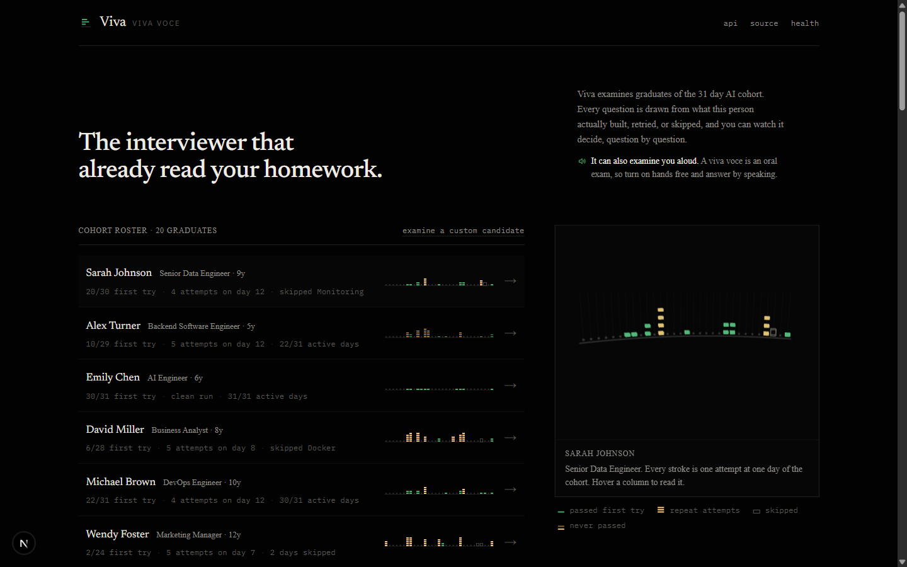
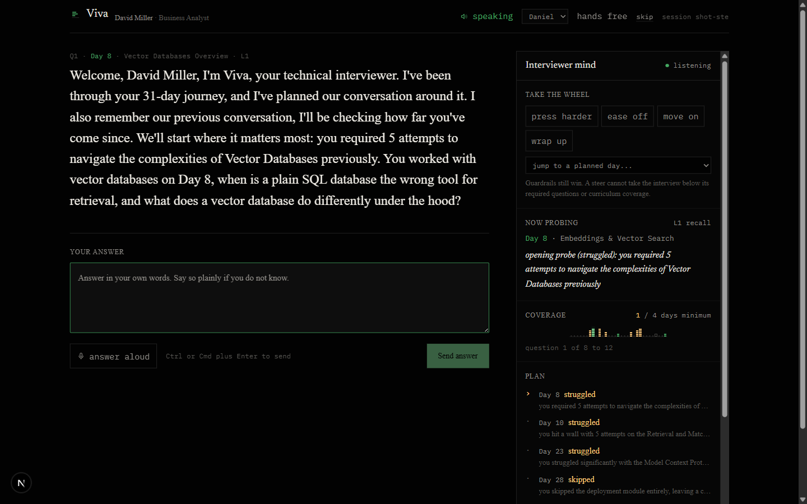
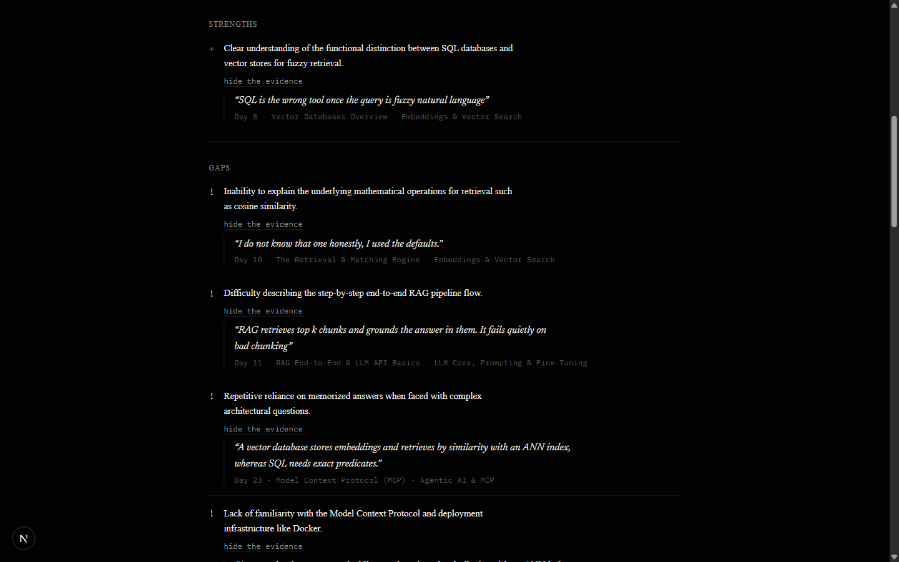
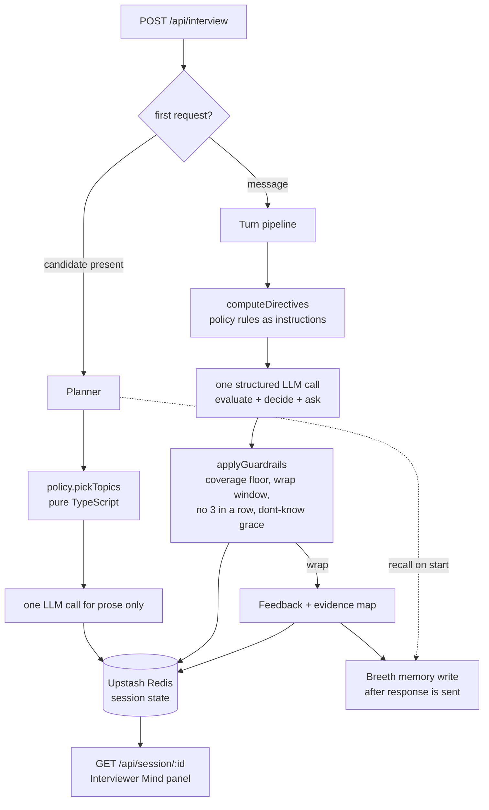

# Viva

**The interviewer that already read your homework.**

An AI technical interviewer for the ABTalks 31 day AI cohort. It plans each interview from the candidate's real learning history, adapts every question to the previous answer, shows its reasoning live while it works, and proves every piece of feedback with the candidate's own words.

---

## The thirty second proof

Pick **David Miller (CAND-004)**, a Business Analyst who needed 5 attempts on vector databases and skipped Docker entirely. His interview opens like this:

> Welcome, David Miller. I'm Viva, your technical interviewer. I've been through your 31 day journey, and I've planned our conversation around it. We'll start where it matters most: you needed 5 attempts to pass the Vector Databases Overview on Day 8.
>
> You worked with vector databases on Day 8, when is a plain SQL database the wrong tool for retrieval, and what does a vector database do differently under the hood?

Answer it well and the next question escalates into HNSW internals, quoting you:

> That is a precise summary of the architectural divide. Since you mentioned that SQL lacks the ability to handle fuzzy natural language, how would you design a hybrid search system that combines exact keyword filtering with vector similarity?

Say "I don't know" and it drops difficulty, notes the gap, and moves on kindly. No question in that interview could have been asked to anyone else in the roster.

---

## What you are looking at



Every candidate's 31 days is drawn in **the examiner's own notation**: one stroke per attempt stacked upward, a hollow box for a skipped day, a brass rule for a day never passed. It is not a chart of the data, it is the data, in the marks an examiner would actually make. The same notation is rendered in 3D beside the roster and re-inks itself as you move between candidates.



The **Interviewer Mind** panel is the differentiator. While you answer, it shows why this question was chosen, which curriculum days are covered against the minimum, per module confidence updating live, the remaining plan, and any policy override that fired. Most interview agents are a black box. This one shows its work.



Every strength and gap in the report opens to reveal **the candidate's verbatim sentence** and the curriculum day behind it. No claim without evidence.

---

## Why this is not a thin wrapper

| Judge's experience | A typical submission | Viva |
|---|---|---|
| First question | "Tell me about RAG" | "You needed 5 attempts on Day 8, when is SQL the wrong tool for retrieval?" |
| Follow ups | The next canned question | Quotes your last answer, then drills, escalates, or switches |
| Transparency | Black box | Live reasoning, coverage, confidence, and policy overrides |
| Feedback | Generic paragraphs | Every point opens to your own quoted words plus the day to revisit |
| Second interview | Amnesia | Remembers the last one and checks whether the gap closed |
| Model outage | 500 | Completes the interview anyway on deterministic fallbacks |

---

## The spoken viva

A *viva voce* is, literally, an examination "by live voice". So Viva conducts one: it asks its questions in a real voice, opens the microphone the moment it stops speaking, and submits your answer when you go quiet. Press nothing, just talk.

**Hands-free mode** is the demo worth watching. The examiner asks, you answer aloud, it evaluates and asks the next question, and the Interviewer Mind panel updates beside it the whole time.

How it is built:

- **Streaming, not synthesise-then-send.** `POST /api/voice` registers a line and returns a short id; `GET /api/voice/[id]` pipes the ElevenLabs stream straight through to an `<audio>` element. The browser plays audio/mpeg progressively, so speech starts before generation has finished. Measured through the proxy on a warm connection: **about 0.6s to first audio**, roughly 0.1s over talking to ElevenLabs directly. The id lives in Redis with a 15 minute TTL, because on serverless the register and the stream can land on different instances.
- **The key never reaches the browser.** Only opaque ids cross the wire, and a requested voice id is pattern checked before it is ever forwarded upstream.
- **The microphone never fights the speaker.** Listening starts only after playback resolves, otherwise the recogniser transcribes the examiner's own question into the answer.
- **Auto-submit is visible, not sprung on you.** After you stop talking the button reads "sending when you stop", and typing a single character cancels the countdown.
- **The candidate's half is free.** Answering uses the browser's own speech recognition, so credits are spent only on the voice that matters, and it is hidden where unsupported.

It is still entirely optional. The problem statement scopes voice out, so the controls are hidden when no key is configured, every failure path (bad key, spent quota, rate limit, autoplay block) falls back to silence, and none of it touches the contract endpoint. The graded product is complete and unchanged without it.

Set `ELEVENLABS_API_KEY` and it turns itself on. The voice picker is populated from your own account at runtime.

## How it works



**The engine is deliberately split in two.** `lib/engine/policy.ts` is pure TypeScript with no LLM calls: it picks which topics to probe from the mission history, and it enforces the hard rules afterwards. The model proposes, policy disposes.

That matters because the problem statement's minimums are contractual, not aspirational. Asking a model nicely for "at least 8 questions across at least 4 days" is a hope. These are enforced in code and unit tested:

- coverage floor: from question 6, if fewer than 4 distinct days are covered, a topic switch is forced
- wrap window: 10 to 12 questions, hard capped at 14, and wrapping is blocked before question 8
- never three consecutive questions on the same curriculum day
- "I don't know" never leads to a harder question, it drops difficulty and moves on
- a difficulty increase after a weak answer is blocked

Every override is recorded in plain language and surfaced in the Mind panel, so you can watch the guardrails fire.

### Never 500 to a judge

Each stage degrades instead of failing:

| Failure | What happens |
|---|---|
| Malformed JSON body | 400 with a JSON error message |
| Unknown sessionId with no candidate | 200, restarts politely in character |
| Gemini primary model fails | Falls back to a second model, with backoff and jitter |
| Both models fail | Deterministic evaluation and a seed question, interview continues |
| Feedback call fails | Report is built from the per turn evaluations already recorded |
| Breeth unreachable or disabled | Silent no op, the product is whole without it |

The offline path is not theoretical. `lib/engine/turn.test.ts` runs a complete interview with no API key and asserts the contract minimums still hold.

---

## The contract

`POST /api/interview`, no auth, state keyed by `sessionId`. Exactly the shape in `docs/technical-spec.md`.

```jsonc
// start
{ "sessionId": "abc-123", "candidate": { ... } }
  -> { "reply": "Welcome, David Miller...", "done": false }

// each turn
{ "sessionId": "abc-123", "message": "A vector database stores embeddings..." }
  -> { "reply": "Since you mentioned...", "done": false }

// the end
  -> { "reply": "That completes our interview...", "done": true,
       "feedback": { "summary": "...", "strengths": [], "gaps": [], "next": [] } }
```

Contract fields are never renamed or removed. Panel data lives on a separate `GET /api/session/[id]` so the judge facing response stays exactly as specified. Try it live at [/api-docs](https://viva-bay.vercel.app/api-docs).

---

## Run it locally

```bash
git clone https://github.com/MONSTERBOY110/Viva.git
cd Viva
npm install
cp .env.example .env.local     # add GEMINI_API_KEY, the rest are optional
npm run dev
```

It runs without any keys at all. With no `GEMINI_API_KEY` the deterministic engine still conducts a complete, contract valid interview, and with no Upstash credentials it falls back to an in memory session store.

```bash
npm test                                        # 38 unit tests
npm run judge-sim                               # full contract test vs localhost
npx tsx scripts/judge-sim.ts https://viva-bay.vercel.app   # or vs production
```

`judge-sim` is the script a judge would write: it runs a whole interview with deliberately mixed answers (strong, weak, evasive, "I don't know"), asserts the response shape on every turn, checks the question count lands in the window, validates the feedback shape, and probes the defensive paths. It currently reports **61 passed, 0 failed** against production.

---

## Stack and decisions

| Layer | Choice | Why |
|---|---|---|
| Framework | Next.js 15, App Router, TypeScript | One repo and one deploy for UI and API |
| Voice (optional) | ElevenLabs Flash v2.5, browser speech recognition | The examiner speaks, the candidate answers aloud, both feature flagged |
| Model | Gemini 3.5 Flash, falling back to 3.1 Flash Lite | Free tier, structured JSON output, about 2s per turn |
| Session state | Upstash Redis, 48h TTL | Serverless functions are stateless, and the judge's multi turn test must stay coherent |
| Long term memory | Breeth (sponsor), feature flagged | Cross session candidate continuity, behind an interface and fail silent |
| UI | Tailwind v4, shadcn/ui on Radix, GSAP, react-three-fiber | Radix for accessibility, GSAP for state motion, WebGL for one earned moment |
| Hosting | Vercel | Push to deploy, no cold sleep during judging |

Two measured decisions worth calling out. The thinking budget is pinned to 0 because measuring it on real turns showed roughly 2s versus 6s with no quality difference on this task shape. And Breeth writes block on `?wait_seconds=30` because asynchronous writes could lag indefinitely before becoming searchable, which is free here since the write runs in `after()` once the response has already been sent.

---

## Design

The direction is documented in [PRODUCT.md](./PRODUCT.md) and [DESIGN.md](./DESIGN.md), including the anti references it was deliberately built away from.

The look is **the examiner's desk at 9pm**: green ink drying on answer scripts, a brass lamp, everything else in shadow. The page is the shadow and the paper is the text, not the background. The interviewer's questions are set in a serif because they are speech; the reasoning panel is sans and mono because it is instrumentation. That tension is the identity.

One house rule worth noting: there is not a single em dash or en dash anywhere in this project, including in model generated interview text. It is enforced in the prompt templates, again by a sanitiser at the LLM boundary in `lib/text.ts`, and it has its own tests.

---

## Repository map

```
app/
  page.tsx                    the cohort roster
  interview/[sessionId]/      conversation plus the Interviewer Mind panel
  report/[sessionId]/         evidence linked report, print friendly
  api-docs/                   live contract playground
  api/interview/route.ts      THE CONTRACT ENDPOINT
  api/session/[id]/route.ts   read model for the Mind panel
  api/voice/route.ts          spoken examiner: capability and registration
  api/voice/[id]/route.ts     streams the audio, silent on any failure
  api/health/route.ts
lib/
  engine/policy.ts            pure TypeScript brain stem, unit tested
  engine/{planner,turn,feedback}.ts
  llm/{gemini,schemas}.ts     provider adapter, zod schemas
  llm/prompts/                every prompt template lives in code
  store/{session,breeth}.ts   Redis and long term memory, both behind interfaces
  journey.ts                  the 31 day model behind the Ledger
  text.ts                     house punctuation rule
components/                   Ledger, Spine, Mind panel, interview room
scripts/judge-sim.ts          the contract test a judge would write
```
